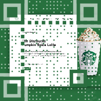
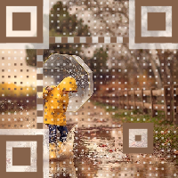

# vue-qr

the Vue 2.x Component for [SumiMakito's Awesome-qr.js](https://github.com/SumiMakito/Awesome-qr.js)

### Examples, 样例

> Try to scan these QR codes below with your smart phone.

Example 1|Example 2|Example 3
------------ | ------------- | -------------
 |  | 

## Installation
**install with NPM**
```bash
npm install vue-qr --save
```
**Import**
```js
import VueQr from 'vue-qr'

new Vue({
    components: {VueQr}
})
```
## Usage
**In template**

```html
<vue-qr :backgroundImage="src" text="Hello world!" height="200" width="200"/>
```
**config**
- text  : Contents to encode. 欲编码的内容
- width : Width, should equal to height. 宽度, 宽高应当一致
- height  : Height, should equal to width. 高度, 宽高应当一致
- colorDark : Color of blocks. Will be OVERRIDE by - autoColor. 实点的颜色
- colorLight : Color of empty space. Will be OVERRIDE by autoColor. 空白点的颜色
- bgSrc: : The background image url 背景图地址
- autoColor : If true, colorDark will be set to the dominant color of backgroundImage. Default is true. 若为 true, 则将从背景图取主要颜色作为实点颜色

For more details you should definitely check out [Awesome-qr.js ](https://github.com/SumiMakito/Awesome-qr.js) 
